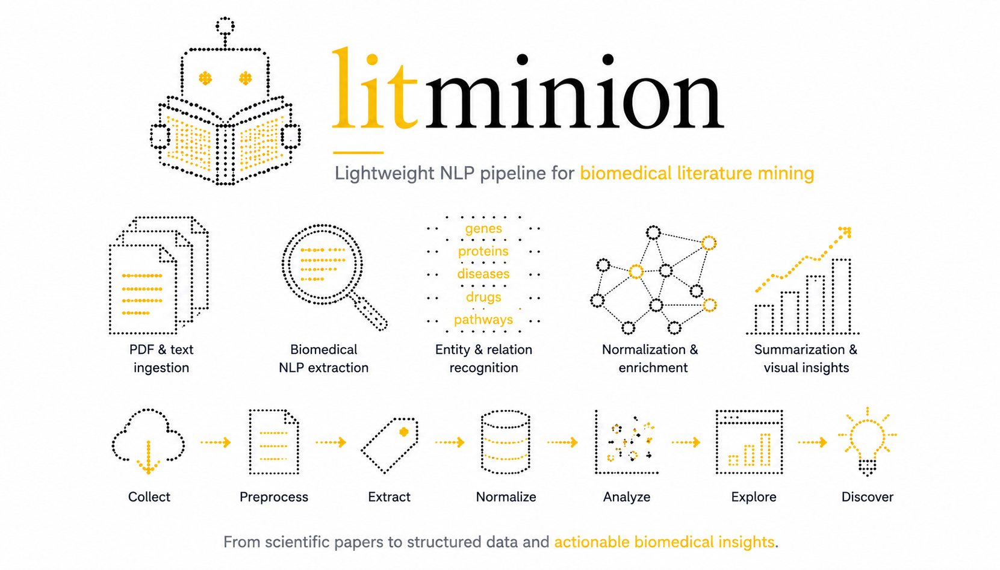

# LitMinion

<p align="center">
  
</p>

<p align="center">
  
</p>

<p align="center">
<b>A modular Python framework for biomedical literature mining and natural language processing.</b>
</p>

---

## Overview

LitMinion is an open-source Python framework for building reproducible biomedical literature mining workflows.

Starting from PubMed publications, it provides a modular pipeline to retrieve scientific articles, preprocess biomedical text, extract knowledge, and support downstream analyses such as keyword extraction, topic modeling, named entity recognition, and literature exploration.

The project emphasizes:

- modular software architecture
- reproducible analysis pipelines
- extensibility through interchangeable NLP backends
- clean and well-documented APIs

Whether you are performing exploratory literature reviews, building biomedical NLP workflows, or developing research tools, LitMinion provides reusable building blocks instead of monolithic scripts.

---

## Features

### Available

- PubMed search via the NCBI Entrez API
- Metadata and abstract retrieval
- XML parsing into pandas DataFrames
- Classical NLP preprocessing with spaCy
- Lazy loading of language models
- Object-oriented preprocessing framework
- Type hints and comprehensive documentation

### Planned

**Data Management**

- Corpus abstraction
- Dataset serialization
- Metadata handling

**Natural Language Processing**

- scispaCy preprocessing
- Transformer-based preprocessing
- Keyword extraction
- TF-IDF
- YAKE
- KeyBERT

**Biomedical NLP**

- Named Entity Recognition
- Drug recognition
- Disease recognition
- Gene and protein extraction

**Machine Learning**

- BERTopic
- Document embeddings
- Abstract classification
- Trend detection

**Visualization**

- Publication trends
- Topic visualization
- Interactive dashboards

---

## Installation

Clone the repository

```bash
git clone https://github.com/<username>/litminion.git
cd litminion
```

Create a virtual environment

```bash
conda create -n litminion python=3.11
conda activate litminion
```

Install the package

```bash
pip install -e .
```

Download the default spaCy model

```bash
python -m spacy download en_core_web_sm
```

---

## Quick Start

```python
import litminion as lm

lm.set_email("your_email@example.com")

df = lm.download_pubmed(
    query="JAK inhibitor",
    max_results=20,
)

preprocessor = lm.ClassicalPreprocessor()

processed = preprocessor.transform(
    df.loc[0, "Abstract"]
)

print(processed)
```

---

## Project Structure

```text
litminion/
│
├── assets/
├── src/
│   └── litminion/
│       ├── data/
│       ├── preprocessing/
│       ├── config.py
│       └── __init__.py
│
├── tests/
├── notebooks/
├── storage/
├── outputs/
├── README.md
├── pyproject.toml
└── requirements.txt
```

---

## Design Principles

LitMinion is built around a few core engineering principles:

- Modular architecture
- Object-oriented design
- Extensible preprocessing pipelines
- Clear public APIs
- Comprehensive documentation
- Type annotations
- Unit testing
- Reproducible workflows

---

## Roadmap

- [x] PubMed API integration
- [x] XML parser
- [x] Literature downloader
- [x] Classical preprocessing pipeline
- [ ] Corpus abstraction
- [ ] Keyword extraction
- [ ] Biomedical preprocessing
- [ ] Topic modeling
- [ ] Named entity recognition
- [ ] Trend analysis
- [ ] Interactive dashboard
